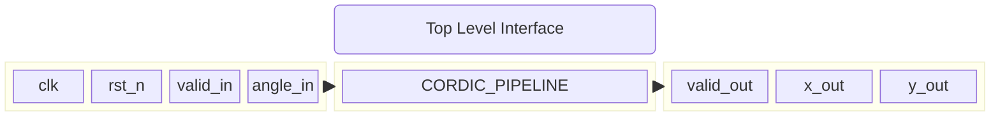
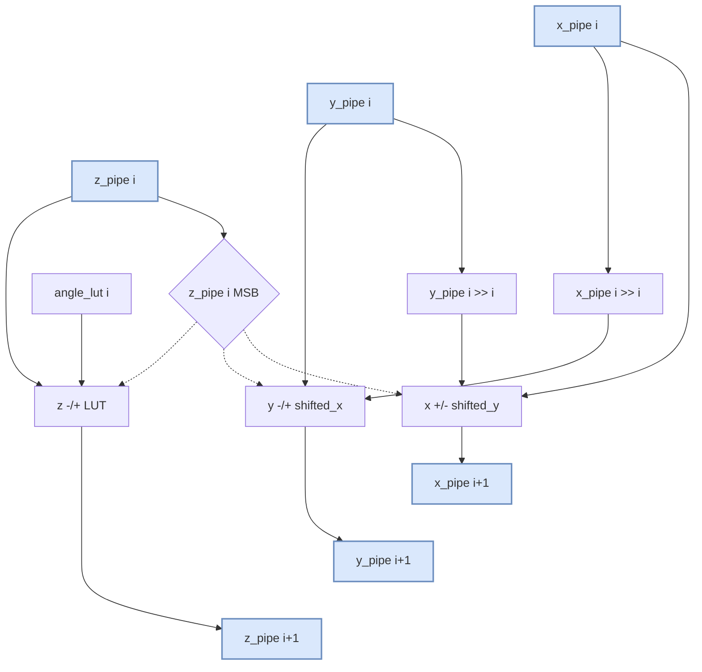
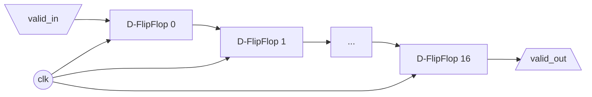

# CORDIC Pipelined Architecture Schematics

This document contains block diagrams illustrating the fully pipelined CORDIC architecture implemented in `cordic.v`.

## 1. Top-Level Module Interface
The top-level module accepts an input angle and a valid signal, and produces the cosine and sine outputs exactly 16 clock cycles later with an accompanying valid output signal.

## 2. 16-Stage Pipelined Datapath Overview
The engine consists of an initial input capture stage (Stage 0) followed by 16 identical computing stages. Data flows continuously from left to right, advancing one stage per clock cycle.

```mermaid
flowchart LR
    %% Define Inputs
    valid_in[\valid_in/]
    angle_in[\angle_in/]
    
    %% Define Stages
    subgraph Stage0 [Input Stage 0]
        direction TB
        V0[valid_pipe 0]
        X0[x_pipe 0: 0.60725]
        Y0[y_pipe 0: 0]
        Z0[z_pipe 0: angle]
    end

    subgraph Stage1 [Compute Stage 1]
        direction TB
        V1[valid_pipe 1]
        X1[x_pipe 1]
        Y1[y_pipe 1]
        Z1[z_pipe 1]
    end

    mid[...]

    subgraph Stage16 [Compute Stage 16]
        direction TB
        V16[valid_pipe 16]
        X16[x_pipe 16]
        Y16[y_pipe 16]
        Z16[z_pipe 16]
    end

    %% Define Outputs
    valid_out[/valid_out\]
    x_out[/x_out : cos\]
    y_out[/y_out : sin\]
    
    %% Connections
    valid_in --> Stage0
    angle_in --> Stage0
    
    Stage0 -->|"x,y,z,valid"| Stage1
    Stage1 -->|"x,y,z,valid"| mid
    mid -->|"x,y,z,valid"| Stage16
    
    Stage16 --> valid_out
    Stage16 --> x_out
    Stage16 --> y_out
```

## 3. Internal Architecture of a Single Compute Stage (Stage $i$)
Inside every computing stage (from $i=0$ to $i=15$), the vector is rotated. The direction of rotation $d_i$ depends on the sign bit (MSB) of the current angle $z_i$.

## 4. Valid Signal Propagation
To avoid the need for an FSM, a validity bit travels alongside the data in the pipeline to indicate when the output is successfully computed.

